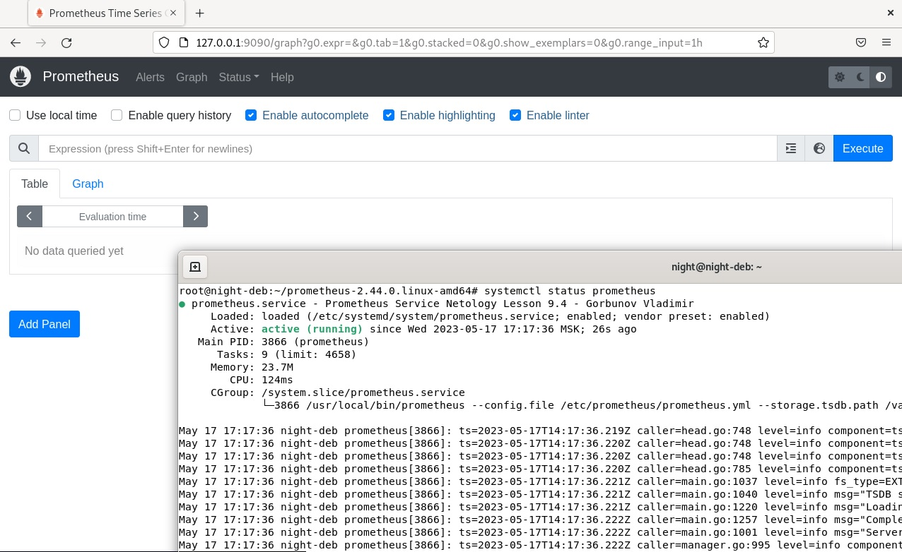
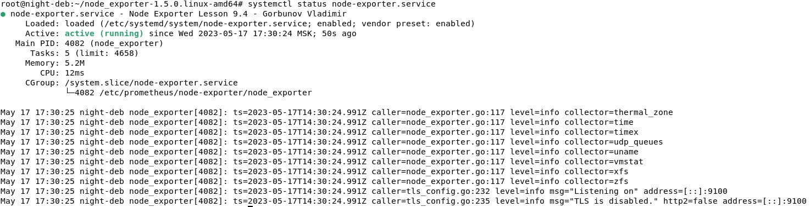
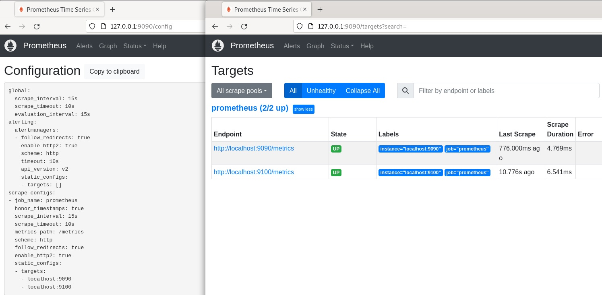
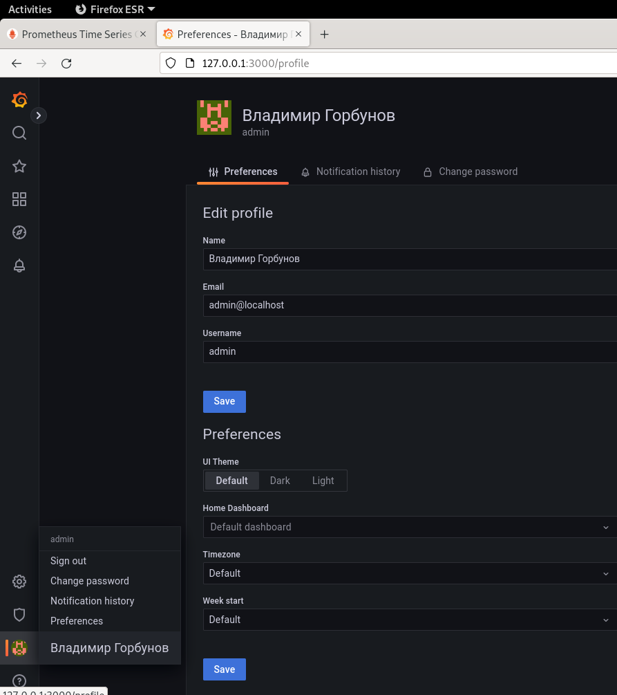
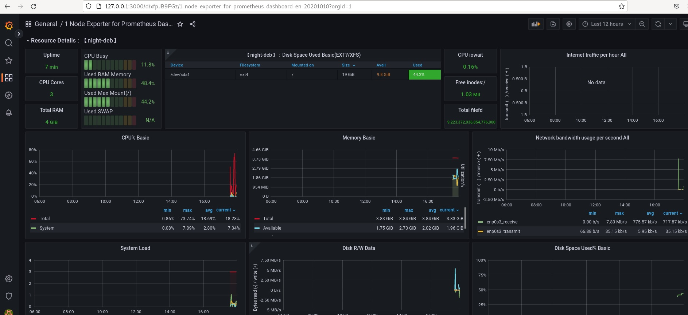

## Система мониторинга Prometheus 
### Домашнее задание 
### Горбунов Владимир

### Задание 1 
- Установка Prometheus.
Прометеус установлен в системе из исходников, и включен как системный юнит: 

---
### Задание 2
- Node Exporter.
На этой же машине установлен Node Exporter, также в качестве системного юнита.  

---
### Задание 3
- Два эндпоинта в прометеусе.  

---
### Задание 4
- Установлена Grafana: 

---
### Задание 5
- Дэшборд (ID:11074) графаны с метриками прометеуса 

---